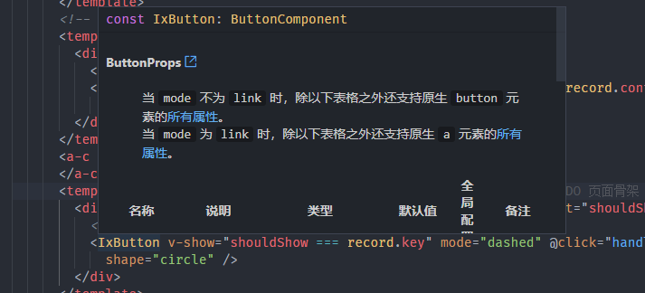
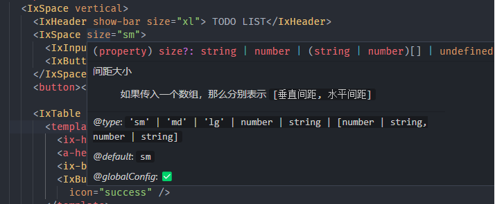
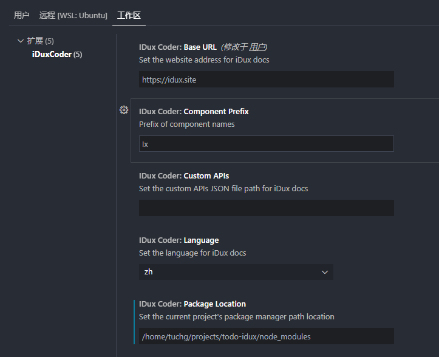

# idux-coder

<!-- Plugin description -->

> 💻 A IDE Extension for iDux

## Feature

* Prompt api docs of component name、props or slots

* Customization
  * Any Component Prefix
  * Any API Docs ( iDux, but more than iDux )
  * Any-Name-Case
  * Any Project architecture
    * Auto detect project node_modules
    * User defined node_modules location

<!-- Plugin description end -->
